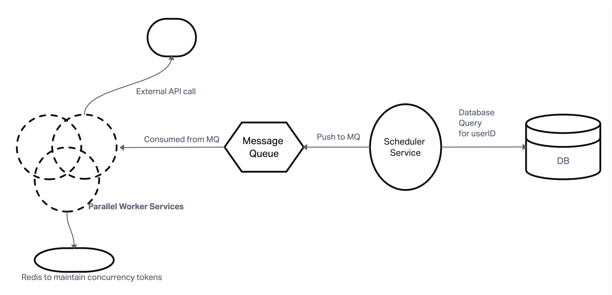

## High-Level Architecture Overview




* `Scheduler Service`: Identifies users with scheduled SIP transactions for the day and enqueues tasks.

* `Message Queue (Task Queue)`: Stores user IDs as tasks to be processed by worker services.

* `Worker Services`: Processes tasks by calling the external API. There are replicas of these service to do concurrent API calls to external API and execute transaction

## Flow

1. The Scheduler Service runs at a scheduled time and fetches all user IDs with SIP transactions scheduled for that day.
2. It enqueues these user IDs as tasks into the Message Queue.
3. Worker Services continuously poll the Message Queue for new tasks.
4. Upon receiving a task, a worker checks the Concurrency Control Mechanism to obtain permission to proceed.
* Concurrency Management:
  The worker attempts to acquire a token from the *global concurrency limiter* and If successful, it proceeds to call the external API; otherwise, it waits or processes other tasks. The system must not exceed 10,000 concurrent requests to the external API.
  - A central pool of tokens (10,000 tokens representing the concurrency limit) is maintained in Redis.
  - Before a worker makes a call to the external API, it must acquire a token from the pool.
  - This ensures that the total number of concurrent API calls across all workers does not exceed 10,000.
  - After the API call is completed (success or failure), the worker releases the token back to the pool, making it available for other workers.

5. If the API call fails, the worker retries according to the defined Retry Mechanism.
And we maintain a `max_retries` count and if retry count exceeds that we move the message to the queue again, in a different topic to process it separately. So basically, message queue can act as Dead leter queue as well.


## Component Breakdown

### 1. Scheduler Service

* Runs at a scheduled time daily.
* Queries the database for users with SIP transactions scheduled for the current day.
* Enqueues user IDs into the message queue for processing.

Here the challenge is `Volume of Data` to query millions of records efficiently:

* To do that, I'll do **Batch Processing** i.e. instead of fetching all records at once, process them in batches using LIMIT and OFFSET 
For example, consider a batch size of `10000`

```sql
SELECT user_id FROM users_sip WHERE scheduled_date = 'YYYY-MM-DD' LIMIT 10000 OFFSET 0;
SELECT user_id FROM users_sip WHERE scheduled_date = 'YYYY-MM-DD' LIMIT 10000 OFFSET 10000;
-- Continue until all records are fetched.
```

* Other than that, I'll ensure that the `scheduled_date` colum  is indexed which'll allow the database to quickly locate all records for a particular date. 

* And for each batch, we enqueue tasks to the message queue, something like:
```python
total_records = get_total_records() # SELECT COUNT(*) FROM users_sip WHERE scheduled_date = 'YYYY-MM-DD'

batch_size = 10000
offset = 0

messages = []

while offset < total_records:
    user_ids = query_database(limit=batch_size, offset=offset)
    for user_id in user_ids:
        message = {"user_id": user_id}
        messages.append(message)
    queue.send_messages(messages)
    offset += batch_size
```

### 2. Message Queue (Task Queue)

* There has to be a buffer between the scheduler and worker services to support high throughput. This MQ will take that place.

* Each message in the queue represents a task to process a user's SIP transaction, something like:
```json
{
  "user_id": "1234567890"
}
```
* We'll do **Batch Enqueuing** as mentioned in above code snippet (pushing messages array to queue) so that reduces the number of network calls to the message queue service.

###  3. Worker Service

* All it has to do is that, consume tasks from the message queue and call the external API with `userID` query parameter to perform the transaction.

* Challenge here is to implement concurrency control to respect the 10,000 concurrent requests limit. We deal it with concurrency tokens maintained in Redis as mentioned in `Flow` section of this README

* And when dealing with APIs, most importnat part is **handling errors, and retries.**

* For Retry Logic: we as mentioned earlier, we maintain maximum number of retries before logging the error if something unrequired happens, this can be done by pushing errored transactions back to the Queue; a dead letter queue to be precise. For example a different `error_topic` in Kafka

* And we will monitor and process the dead-letter queue separately.


## Implementation Details:

1. `Scheduler Service`

* Language: Python or Golang

* Scheduling Mechanism: Use a cron job or cloud-based scheduler like AWS CloudWatch Events


2. `Message Queue` 

* Kafka: Suitable for high throughput and scalability.
Configured with appropriate retention timeouts and error_topic for failed messages.

3. `Worker Service`

* Language: Go due to its excellent concurrency model. We can use goroutines to handle multiple tasks concurrently within a worker instance. 

* i'LL mplement retries with exponential backoff.

* One important thing is Idempotency in worker i.e. to ensure that retrying a transaction does not result in duplicate processing.
For that we can use unique transaction IDs or check transaction status before execution.


