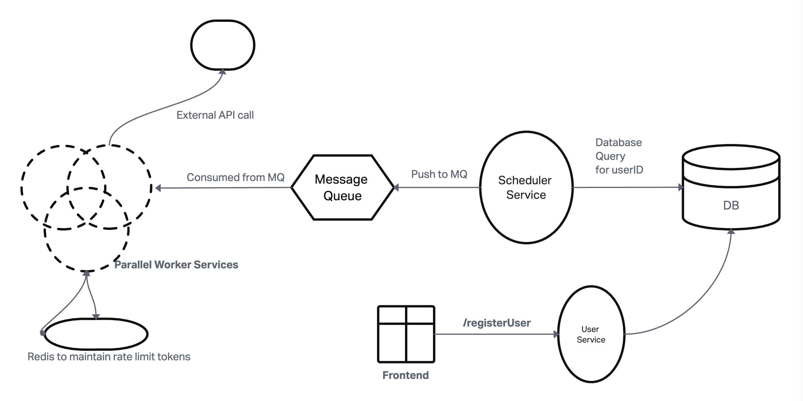

## High-Level Architecture Overview




* `User Service`: Manages user registration and authentication.

* `Scheduler Service`: Identifies users with scheduled SIP transactions for the day and enqueues tasks.

* `Message Queue (Task Queue)`: Acts as buffer between scheduler and workers. Stores user IDs as tasks to be processed by worker services.

* `Worker Services`: Processes tasks by calling the external API. There are replicas of these service to do concurrent API calls to external API and execute transaction

* `Rate Limiter`: For worker instances that coordinates across all worker Services to prevent exceeding the API rate limit threshold

## Flow
1. User interacts with the UI to register and set his SIP preferences.
2. User Service stores user's data and his SIP preference in the database.
2. The Scheduler Service runs at a scheduled time and fetches all user IDs with SIP transactions scheduled for that day.
3. It enqueues these user IDs as tasks into the Message Queue.
4. Worker Services continuously poll the Message Queue for new tasks.
5. Upon receiving a task, a worker checks the Rate Limit Mechanism to obtain permission to proceed.
* Rate Limit Management:
  The worker attempts to acquire a token from the *global rate limiter* and If successful, it proceeds to call the external API; otherwise, it waits and retries after a short delay. The system must not exceed 5000 RPS to the external API.
  - We can use **Token Bucket Algorithm** here. The bucket in redis holds a maximum of 5000 tokens, refilling the buket at 5000 tokens per second. 

6. If the API call fails, the worker retries according to the defined Retry Mechanism.
And we maintain a `max_retries` count and if retry count exceeds that we move the message back to the queue again, in a different topic to process it separately. So basically, message queue can act as Dead leter queue as well.


## Component Breakdown

### 1. Scheduler Service

* Runs at a scheduled time daily.
* Queries the database for users with SIP transactions scheduled for the current day.
* Enqueues user IDs into the message queue for processing.

Here the challenge is *Volume of Data* to query millions of records efficiently:

* To do that, I'll do **Batch Processing** i.e. instead of fetching all records at once, process them in batches using LIMIT and OFFSET 
For example, consider a batch size of `5000`

```sql
SELECT user_id FROM users_sip WHERE scheduled_date = 'YYYY-MM-DD' LIMIT 5000 OFFSET 0;
SELECT user_id FROM users_sip WHERE scheduled_date = 'YYYY-MM-DD' LIMIT 5000 OFFSET 5000;
-- Continue until all records are fetched.
```

* Other than that, I'll ensure that the `scheduled_date` colum  is indexed which'll allow the database to quickly locate all records for a particular date. 

* And for each batch, we enqueue tasks to the message queue, something like:
```python
total_records = get_total_records() # SELECT COUNT(*) FROM users_sip WHERE scheduled_date = 'YYYY-MM-DD'

batch_size = 5000
offset = 0

messages = []

while offset < total_records:
    user_ids = query_database(limit=batch_size, offset=offset)
    for user_id in user_ids:
        message = {"user_id": user_id}
        messages.append(message)
    queue.send_messages(messages)
    offset += batch_size
```

### 2. Message Queue (Task Queue)

* Each message in the queue represents a task to process a user's SIP transaction, something like:
```json
{
  "user_id": "1234567890"
}
```
* We'll do **Batch Enqueuing** as mentioned in above code snippet (pushing messages array to queue) so that reduces the number of network calls to the message queue service.

###  3. Worker Service

* All it has to do is that, consume tasks from the message queue and call the external API with `userID` query parameter to perform the transaction.

* Challenge here is to implement rate limiting control to respect the 5000 RPS limit. We deal it with tokens maintained in Redis as mentioned in `Flow` section of this README

* And when dealing with APIs, most importnat part is **handling errors, and retries.**

* For Retry Logic: we as mentioned earlier, we maintain maximum number of retries before logging the error if something unrequired happens, this can be done by pushing errored transactions back to the Queue; a dead letter queue to be precise. For example a different `error_topic` in Kafka

* But when dealing with retries, Idempotency also needs to be considered to ensure that retrying a transaction does not result in duplicate processing.
For that we can use unique transaction IDs or check transaction status before execution.

* And for error handling, we will monitor and process the dead-letter queue separately.


## Implementation Details:

1. `User Sevice`
It can be a simple node server, listening to /registerUser endpoint route using express. 


2. `Scheduler Service`

* Language: Again TypeScript can be used to easily implement this.

* Scheduling Mechanism: Use a cron job or cloud-based scheduler like AWS CloudWatch Events


3. `Message Queue` 

* Kafka: Suitable for high throughput and scalability.
Configured with appropriate retention timeouts and `error_topic` for failed messages.

4. `Worker Service`

* Language: Go due to its excellent concurrency model. We can use goroutines to handle multiple tasks concurrently within a worker instance. 

5. `Rate Limiter`
*  Redis: for high Performance and low Latency


## Assumptions
System is running on AWS and Workers are running as part of an Auto scaling group which scales based on the user base custom metric.
We are using AWS Cloudwatch events to scheudle the schduler service which can run in a serverless environment in Lambda.


## Trade-off Analysis

1. Latency vs. Throughput:

Trade-off: Implementing rate limiting may introduce slight delays in processing investments due to queuing.

2. Cost vs. Performance:
Trade-off: Using managed cloud services and auto-scaling can increase operational costs.